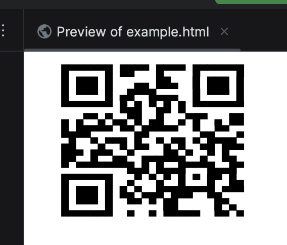

## Print QR Code In Console

### Usages

Add maven dependency in pom.xml:

```xml
<dependency>
    <groupId>pro.leaco.qrcode</groupId>
    <artifactId>console-qrcode</artifactId>
    <version>1.0.1</version>
</dependency>
```

___

#### Print QR code in console
Use the following code (java or kotlin):

```kotlin
ConsoleQrcode.print("https://www.github.com");
```

The console will print the QR code as following:


___

#### Get the unicode QR code string

Use the following code (java or kotlin):
```kotlin
//for kotlin
val code:String = ConsoleQrcode.print("https://www.github.com")
println(code);
```
```java
//for java
String code = ConsoleQrcode.print("https://www.github.com");
System.out.println(code);
```
Then we can see the unicode QR code string like this:
```html
                                 
                                 
    █▀▀▀▀▀█ ██▀▀ █▀▀▀ █▀▀▀▀▀█    
    █ ███ █   ▄▄ ██▄  █ ███ █    
    █ ▀▀▀ █ ▄█▀▀█▄▄▄  █ ▀▀▀ █    
    ▀▀▀▀▀▀▀ █▄█ ▀▄█ █ ▀▀▀▀▀▀▀    
    ▄ ▄▀▀▄▀▄▄▀█ ▄█  ▄▀█▀ ▄ ██    
    █▄██▀▀▀ ▀▀▄█▀▀▀▀  ▀▄▄▀▀ ▄    
    ▄█  ▀▄▀▀█ █▄ ▀▄▀█ ▀▄█▀██▄    
    ██▀ █▀▀▄▄▀ ▄▄▄██▄▀ ▄▀ █▄     
    ▀ ▀▀▀▀▀▀▀█▄█ █▄▄█▀▀▀█▄▄█▀    
    █▀▀▀▀▀█  ▄▀ ▀▄▀ █ ▀ █▀ █▄    
    █ ███ █ █▄▀▄▄█▀███▀▀█▄▀▀▀    
    █ ▀▀▀ █  ▀▀ ▀ ██     █▀▄     
    ▀▀▀▀▀▀▀  ▀  ▀ ▀▀▀▀▀  ▀▀ ▀    
                                 
```

But because of the line-high, we can not scan the QR code successfully.
If we would like to use the unicode QR code, we can adjust the screen printer's
line-high.

e.g.
```html
<pre style="line-height: 12px;font-size: 12px;font-weight:normal">
    █▀▀▀▀▀█ ██▀▀ █▀▀▀ █▀▀▀▀▀█
    █ ███ █   ▄▄ ██▄  █ ███ █
    █ ▀▀▀ █ ▄█▀▀█▄▄▄  █ ▀▀▀ █
    ▀▀▀▀▀▀▀ █▄█ ▀▄█ █ ▀▀▀▀▀▀▀
    ▄ ▄▀▀▄▀▄▄▀█ ▄█  ▄▀█▀ ▄ ██
    █▄██▀▀▀ ▀▀▄█▀▀▀▀  ▀▄▄▀▀ ▄
    ▄█  ▀▄▀▀█ █▄ ▀▄▀█ ▀▄█▀██▄
    ██▀ █▀▀▄▄▀ ▄▄▄██▄▀ ▄▀ █▄
    ▀ ▀▀▀▀▀▀▀█▄█ █▄▄█▀▀▀█▄▄█▀
    █▀▀▀▀▀█  ▄▀ ▀▄▀ █ ▀ █▀ █▄
    █ ███ █ █▄▀▄▄█▀███▀▀█▄▀▀▀
    █ ▀▀▀ █  ▀▀ ▀ ██     █▀▄
    ▀▀▀▀▀▀▀  ▀  ▀ ▀▀▀▀▀  ▀▀ ▀
</pre>
```

Then, we can get the correct QR code in web browser:


