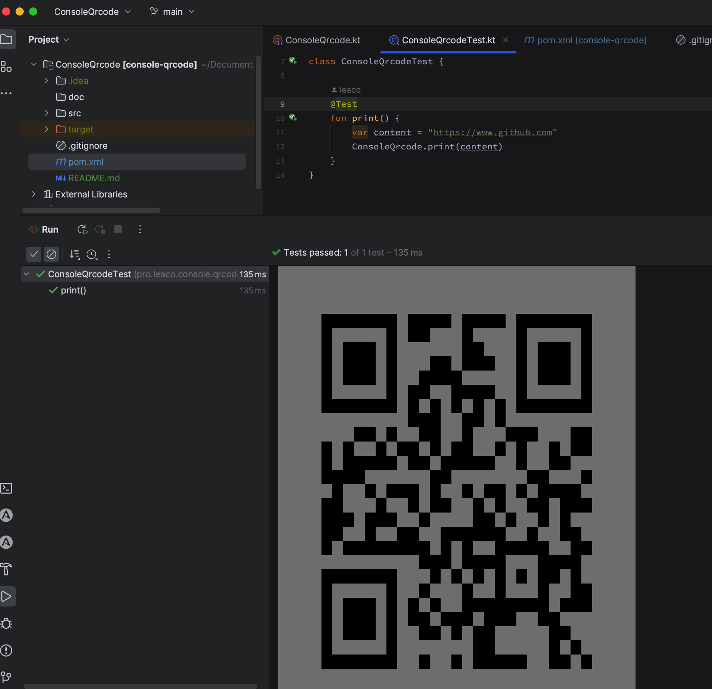

## Print QrCode In Console

### usages

add maven dependency in pom.xml:

```xml
<dependency>
    <groupId>pro.leaco.qrcode</groupId>
    <artifactId>console-qrcode</artifactId>
    <version>1.0.0</version>
</dependency>
```

then use these code (java or kotlin):

```kotlin
ConsoleQrcode.print("https://www.github.com");
```

the console will print the qrcode like this:




